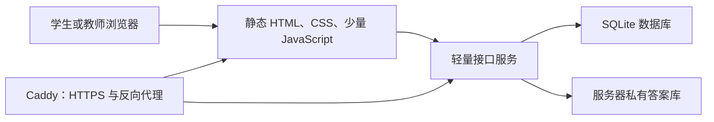
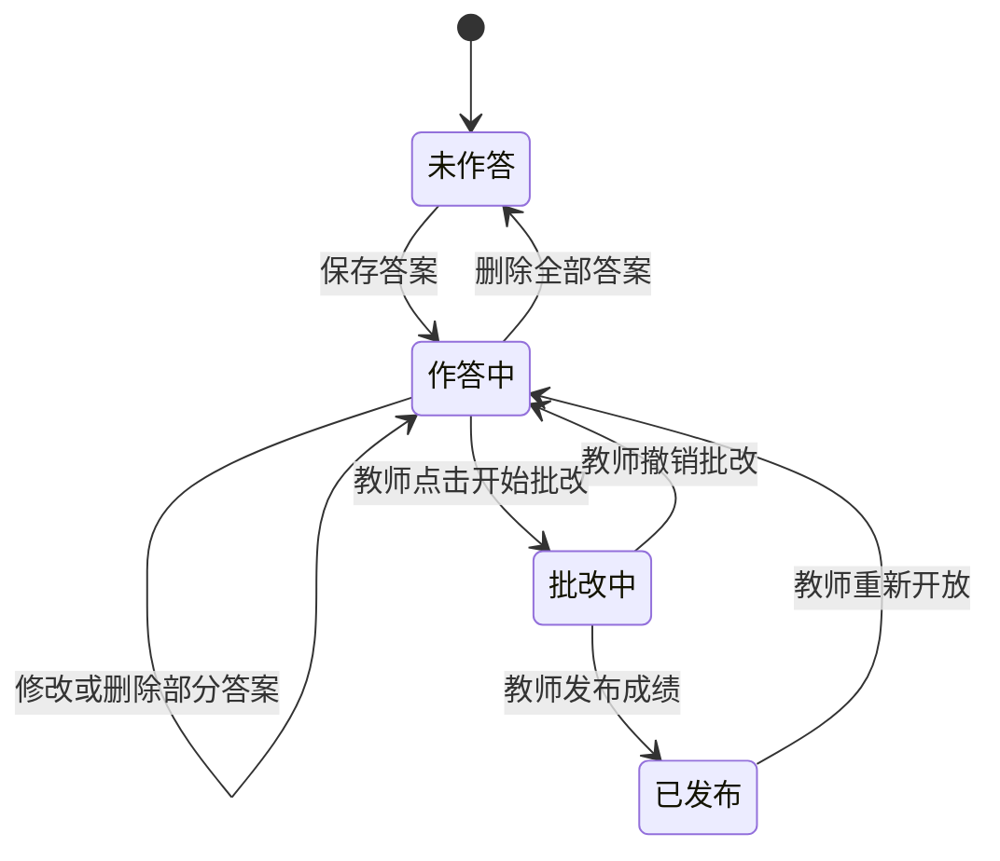

# 学生专项练习网站建设方案（第一版）

## 1. 建设目标

在一台 2 核 CPU、2 GB 内存的服务器上，建设一个轻量、容易维护的专项练习网站。

学生可以：

- 使用自己选择的唯一用户名和密码登录；
- 查看可练习的专题和完成进度；
- 在日常练习模式中自主选择练习和题目，不设倒计时；
- 保存、修改或删除尚未批改的答案；
- 教师发布批改结果后，查看总分、每题得分、对错情况；
- 答错时查看正确答案和必要的解析。

教师可以：

- 创建学生激活码，或直接创建学生账号；
- 修改学生用户名、重置密码、停用账号和强制退出登录；
- 发布、隐藏练习；
- 查看每位学生的作答进度；
- 对客观题自动判分；主观题由教师人工给分；
- 为单题填写评语，并为整套练习填写总体评语；
- 对单个学生开始批改，或勾选多个学生批量开始批改；
- 一键发布某次批改结果；
- 查看每套练习中每一道题的作答人数、正确人数和正确率；
- 必要时撤销批改、重新开放作答或重新发布成绩。

## 2. 推荐技术方案

采用“静态练习页面 + 小型接口服务 + SQLite 数据库”。



推荐组合：

- 前端：原生 HTML、CSS、JavaScript，不使用 React、Vue 等大型前端框架；
- 页面生成：用一个很小的脚本把练习内容生成成多个静态页面；
- 后端：Node.js + Fastify；
- 数据库：SQLite；
- HTTPS 与域名：Caddy；
- 后台运行：Linux `systemd`；
- 默认不使用 Docker，减少服务器占用和维护层级。

这套方案的特点：

- 每个练习都有独立网址和静态页面；
- 页面打开快，服务器主要只处理登录、保存答案和批改；
- 不需要复杂的前端构建；
- SQLite 不需要单独运行数据库服务，适合人数有限的轻量教学系统；
- 后续由 AI Agent 修改题目和页面也比较直接。

## 3. 为什么不能做成完全静态网站

账号、密码、学生答案、成绩和批改状态必须保存在服务器上，因此网站不能完全静态。

特别要注意：正确答案不能提前写进学生能下载的 HTML 或 JavaScript 中，否则学生可以通过查看网页源代码找到答案。

因此采用以下分离方式：

- 静态页面：题目、题号、分值、输入框和页面布局；
- 服务器数据库：账号、学生答案、作答状态、得分；
- 服务器私有答案库：正确答案、评分要点和解析；
- 只有练习被教师批改并发布后，接口才向该学生返回未得满分题目的正确答案和解析。

## 4. 页面规划

### 4.1 公共页面

| 页面 | 作用 |
|---|---|
| `/login.html` | 学生和教师登录 |
| `/activate.html` | 学生使用教师提供的激活码，自定义用户名和密码 |
| `/change-password.html` | 首次登录修改密码 |
| `/help.html` | 简单使用说明 |

### 4.2 学生页面

| 页面 | 作用 |
|---|---|
| `/student/index.html` | 专项练习列表、完成状态和成绩概览 |
| `/practice/topic1a-motion.html` | 1A Motion 专项练习 |
| `/practice/topic1b-energy.html` | 1B Energy 专项练习 |
| `/practice/topic1c-momentum.html` | 1C Momentum 专项练习 |
| `/practice/topic1-mechanics-test.html` | Topic 1 综合单元测试 |
| `/student/results.html` | 已发布成绩的集中查看页面 |

后续增加练习时，每套练习生成一个独立页面，例如：

```text
/practice/topic2a-materials.html
/practice/topic2b-waves.html
```

### 4.3 教师页面

| 页面 | 作用 |
|---|---|
| `/teacher/index.html` | 学生、练习和待批改数量概览 |
| `/teacher/students.html` | 创建激活码，修改用户名，重置密码，停用账号 |
| `/teacher/exercises.html` | 发布、隐藏和查看练习 |
| `/teacher/submissions.html` | 按练习、学生和状态筛选作答 |
| `/teacher/review.html` | 批改、给分、写评语并发布成绩 |
| `/teacher/question-stats.html` | 查看每道题的作答人数、正确率和平均得分率 |

## 5. 学生作答流程

1. 学生登录。
2. 在练习列表中选择一套练习。
3. 自主选择要作答的题目。
4. 输入答案后点击“保存”，也可以启用轻量自动保存。
5. 在教师开始批改前，学生可以反复修改或删除答案。
6. 教师可以锁定单个学生，也可以勾选多个学生批量点击“开始批改”。
7. 系统分别锁定每个被选学生当时的作答快照。
8. 教师完成评分、逐题评语和总体评语后，点击“发布成绩”。
9. 学生再次登录后，可以看到：
   - 总分和满分；
   - 每题得分；
   - 正确、错误或部分正确；
   - 学生提交的答案；
   - 未得满分题目的正确答案；
   - 该题的教师评语；
   - 整套练习的总体评语。

## 6. 作答状态设计



权限规则：

| 状态 | 学生修改答案 | 学生看正确答案 | 教师操作 |
|---|---:|---:|---|
| 未作答 | 可以 | 不可以 | 查看 |
| 作答中 | 可以 | 不可以 | 开始批改 |
| 批改中 | 不可以 | 不可以 | 评分、撤销 |
| 已发布 | 不可以 | 可以查看错题答案 | 查看、重新开放 |

“开始批改”必须在数据库事务中锁定学生当时的答案版本，避免学生和教师同时操作造成答案变化。

教师端提供两种入口：

- 单个锁定：在某位学生的作答详情中点击“开始批改”；
- 批量锁定：在作答列表勾选多个学生，点击“批量开始批改”。

批量操作应逐个返回结果。如果某位学生已经锁定、已经发布或没有任何答案，页面要明确显示，不影响其他符合条件的学生被锁定。

## 7. 批改方式

当前物理练习分为选择题、直接计算数值题和主观题三类。第一版按题型使用清楚、可复核的固定规则。

第一版采用以下批改方式：

- 单项选择题：系统对照正确选项自动判分，正确得该题满分，错误得 0 分，不设部分分；
- 直接计算数值题：改为填空题，学生只填写数值，不填写单位；
- 数值题页面明确显示指定单位和必须保留的小数位数；小数位数不符合要求时不允许保存；
- 科学计数法统一使用 `1.1*10^2` 格式，也接受乘号写作 `×`，不使用含单位的答案；
- 数值题按标准数值和由末位精度推导的容差自动判分，正确得该题满分，错误得 0 分，不设部分分；
- 问答、解释、实验评价以及需要说明过程的题目归为主观题，只由教师人工给分；
- 选择题和数值题的自动分数不可手动修改，教师仍可填写逐题评语；
- 每题支持教师评语，整套练习支持总体评语；
- 所有题目确认后，点击“发布成绩”。

自动判分只覆盖选择题和直接计算数值题；主观题始终由教师给分。

成绩发布后，正确答案的显示规则为：

- 得到满分的题：只显示“正确”和学生自己的答案，不显示标准答案；
- 得分低于满分的题：显示“部分正确”或“错误”、学生答案、正确答案、解析和教师评语；
- 未作答题：显示“未作答”，并视为未得满分题，可显示正确答案；
- 其他学生的答案、得分和评语永远不向该学生显示。

## 8. 逐题正确率统计

教师端为每套练习提供“逐题统计”表，例如：

| 题号 | 满分 | 已作答人数 | 已批改人数 | 完全正确人数 | 正确率 | 平均得分率 |
|---|---:|---:|---:|---:|---:|---:|
| 1 | 1 | 28 | 28 | 21 | 75.0% | 75.0% |
| 2 | 4 | 25 | 23 | 12 | 52.2% | 68.5% |

统计口径必须明确：

- “已作答人数”只统计该题保存了非空答案的学生，空白题不进入分母；
- “正确率”默认按已经完成批改的学生计算；
- 完全得到该题满分，记为“完全正确”；
- 部分得分不计入完全正确人数，但会进入平均得分率；
- 正确率公式为：

```text
完全正确人数 ÷ 已批改且作答人数 × 100%
```

- 平均得分率公式为：

```text
该题所有已批改学生的得分总和
÷（该题满分 × 已批改且作答人数）× 100%
```

教师页面应同时显示人数和百分比，不能只显示百分比。例如显示“21/28，75.0%”，避免样本人数很少时产生误解。

选择题还可以显示各选项的选择人数；数值题可以显示常见错误答案。解释题和实验题的统计以教师实际给分为准。

统计数据只供教师查看，在教师保存批改结果后更新，不会向学生泄露其他人的答案或成绩。

## 9. 数据结构

建议的核心数据表：

| 数据表 | 保存内容 |
|---|---|
| `users` | 唯一用户名、密码摘要、教师备注、角色、账号状态 |
| `activation_tokens` | 教师生成的一次性学生激活码、有效期和使用状态 |
| `exercises` | 练习名称、页面地址、状态、版本 |
| `questions` | 题号、题型、分值和题目版本 |
| `answer_keys` | 正确答案、容差、评分要点；仅服务器可访问 |
| `attempts` | 某学生对某练习的作答状态、总分、总体评语和发布时间 |
| `responses` | 每一道题的学生答案和保存时间 |
| `grading_items` | 每题得分、对错状态、逐题教师评语 |
| `audit_logs` | 改用户名、重置密码、开始批改、发布成绩、重新开放等关键操作记录 |

练习和答案都要带版本号。教师开始批改后保存：

- 学生答案快照；
- 当时使用的题目版本；
- 当时使用的答案和评分标准版本。

这样即使以后修改题目，也不会影响已经发布的旧成绩。

不建立班级和班级成员数据表。所有学生直接存在 `users` 表中，教师可按用户名、教师备注、练习和作答状态进行查找和筛选。

逐题正确率可以在打开统计页面时直接从 `responses` 与 `grading_items` 计算。第一版不必额外建立统计表，避免出现统计缓存与实际成绩不同步的问题。

## 10. 账号与安全

第一版不开放任何人直接自由注册。学生通过教师发放的一次性激活码创建账号，并自行确定用户名和密码。

账号方案：

- 教师点击“创建学生激活码”，可填写一个仅教师可见的姓名或备注；
- 学生打开激活页面，输入激活码；
- 学生自行设置用户名和密码；
- 用户名必须唯一，建议限制为 3～24 个字符，可使用字母、数字、下划线和常用中文；
- 用户名比较时忽略英文字母大小写，避免 `Student1` 与 `student1` 被视为两个账号；
- 保留 `admin`、`teacher`、`system` 等系统用户名，不允许学生使用；
- 激活码单次有效，使用后立即失效，并设置过期时间；
- 教师也可以跳过激活码，直接创建学生用户名和临时密码；
- 教师可以修改学生用户名、停用或重新启用账号；
- 教师可以重置学生密码，但不能查看学生原密码；
- 重置后生成临时密码，并要求学生下次登录修改；
- 教师可以让某个账号的全部现有登录状态立即失效；
- 密码只保存加密摘要，不保存明文；
- 登录状态使用 `HttpOnly`、`SameSite` Cookie；正式启用 HTTPS 后再强制 `Secure`；
- 学生只能查看自己的答案和成绩；
- 教师页面和教师接口必须验证教师角色；
- 连续登录失败时短暂限制尝试次数；
- 所有正式访问使用 HTTPS。

还需要防止：

- 学生修改网址查看别人的成绩；
- 学生在批改后调用旧接口修改答案；
- 未批改时通过接口或网页源代码获取正确答案；
- 同一答案被两个浏览器同时覆盖；
- 教师误操作后没有恢复或审计记录；
- 学生反复尝试用户名或激活码猜测其他账号。

## 11. 题目内容的保存方式

建议把内容分成两部分：

### 可公开题目

保存在网站项目中，可以由现有 Markdown 练习转换生成：

```text
content/public/topic1a-motion.json
content/public/topic1b-energy.json
content/public/topic1c-momentum.json
content/public/topic1-mechanics-test.json
```

### 私有答案

保存在服务器私有目录或数据库中，不进入学生静态页面：

```text
content/private/topic1a-motion.answers.json
content/private/topic1b-energy.answers.json
content/private/topic1c-momentum.answers.json
content/private/topic1-mechanics-test.answers.json
```

部署时应保证 `content/private` 无法被浏览器直接访问。

## 12. 推荐项目目录

```text
PAGE/
├─ 网站建设方案.md
├─ README.md
├─ package.json
├─ public/
│  ├─ login.html
│  ├─ student/
│  ├─ teacher/
│  ├─ practice/
│  └─ assets/
├─ content/
│  ├─ public/
│  └─ private/
├─ server/
│  ├─ app.js
│  ├─ auth/
│  ├─ routes/
│  └─ grading/
├─ database/
│  ├─ migrations/
│  └─ backups/
├─ scripts/
│  ├─ build-pages.js
│  ├─ import-students.js
│  └─ import-exercises.js
└─ deploy/
   ├─ Caddyfile
   └─ systemd/
```

实际开发时可以先建立较少的文件，等功能增长后再拆分。

## 13. 服务器部署与资源控制

正式使用时建议运行结构：

```text
Caddy
├─ 直接提供静态页面和资源
└─ 把 /api/* 转发给 Node.js 接口服务

Node.js 接口服务
└─ 读写 SQLite 和私有答案
```

### 第一阶段测试访问

暂时不要求域名。测试时由 Node.js 服务直接监听一个端口，例如：

```text
http://服务器IP:80
```

学生和教师都通过这个地址进入登录页面。服务监听服务器的网络地址，并在防火墙中只开放选定的测试端口。

需要注意：普通 `http://IP:端口` 不会加密登录密码。测试阶段应遵守以下规则：

- 只使用专门的测试账号和测试密码；
- 测试密码不得与微信、邮箱、学校系统或其他网站密码相同；
- 优先只允许可信校园网络、家庭网络或指定 IP 访问测试端口；
- 不在测试数据库中放入敏感个人信息；
- 结束测试后及时关闭端口或更换测试密码；
- 正式给学生长期使用前，切换到域名和 HTTPS。

如果测试服务器直接暴露在公共互联网，建议即使没有域名也通过 VPN 或其他加密通道访问，避免密码以明文在网络中传输。

资源控制建议：

- 静态文件设置浏览器缓存；
- Node.js 只运行一个进程；
- SQLite 开启 WAL 模式和外键检查；
- 限制单次请求大小；
- 页面不使用大图片和大型前端依赖；
- 练习页面按专题拆分，不一次加载全部题库；
- 每天自动备份数据库；
- 定期把备份复制到服务器之外；
- 保留最近若干份备份，并实际测试恢复。

## 14. 后期考试计时模式

后期可以加入计时功能，而且不需要推翻第一版结构。建议把练习分成两种模式：

| 模式 | 时间限制 | 到时行为 | 学生修改 |
|---|---|---|---|
| 日常练习 `practice` | 不限时 | 教师开始批改后锁定 | 批改前可修改、删除 |
| 计时考试 `exam` | 教师设置时长 | 到时自动锁定并交卷 | 剩余时间内可修改 |

为了以后平滑增加计时考试，第一版数据库可以提前为练习和作答预留以下字段：

- `mode`：`practice` 或 `exam`；
- `duration_minutes`：考试时长；
- `available_from`：允许开始时间；
- `deadline`：最晚开始或统一截止时间；
- `started_at`：学生实际点击“开始考试”的服务器时间；
- `expires_at`：该学生的考试结束时间；
- `submitted_at`：交卷或自动交卷时间；
- `extra_time_minutes`：教师为个别学生增加的时间。

计时必须以服务器时间为准，浏览器上的倒计时只用于显示，不能由学生修改本机时间绕过。

推荐考试流程：

1. 教师把练习设置为考试模式并指定时长。
2. 学生点击“开始考试”后，服务器记录开始与结束时间。
3. 学生可以在题目之间自由切换，答案持续自动保存。
4. 刷新页面或重新登录不会重置时间。
5. 网络短暂中断时倒计时继续；恢复后同步尚未上传的答案。
6. 时间到达后，服务器拒绝新的修改并自动锁定答案。
7. 教师批改并发布成绩后，学生才能查看未得满分题目的正确答案。

可以后期再增加统一开考时间、提前交卷、教师延时、异常中断处理和考试操作日志。第一版只需要预留字段，不启用考试入口，日常练习仍然完全不限时。

## 15. 第一版开发范围

第一版只实现必要功能：

1. 教师账号和学生账号登录；
2. 学生用激活码自定义用户名和密码；
3. 教师修改用户名、重置密码、停用账号和强制退出；
4. 四套 Topic 1 练习页面；
5. 学生选择题目、保存、修改和删除答案；
6. 教师查看待批改作答；
7. 教师锁定单个学生或勾选多个学生批量锁定；
8. 客观题预判，主观题完全由教师给分；
9. 教师填写逐题评语和总体评语；
10. 发布成绩；
11. 学生查看分数、对错、评语，以及未得满分题目的正确答案；
12. 教师查看每道题的作答人数、正确率和平均得分率；
13. 教师撤销批改或重新开放；
14. SQLite 备份与恢复说明；
15. 通过 `IP:端口` 进行第一阶段测试；
16. 在数据结构中预留后期考试计时字段，但暂不启用计时。

第一版暂不加入：

- 在线注册；
- 正式的考试倒计时和到时自动交卷界面；
- 排行榜；
- 聊天、论坛和消息系统；
- AI 自动批改主观题；
- 排课和课程表；
- 手机应用；
- 大型后台管理框架。

## 16. 建议开发顺序

1. 建立学生激活、自定义用户名和教师账号管理规则。
2. 把现有 Topic 1 练习与答案整理成题目数据。
3. 建立数据库、登录和角色权限。
4. 完成一个练习页面的保存、修改、删除闭环。
5. 完成教师单个/批量锁定、主观题给分、评语和成绩发布闭环。
6. 完成学生成绩、评语和未得满分题目的答案页面。
7. 完成教师逐题正确率和平均得分率统计。
8. 把其余三套练习生成成独立静态页面。
9. 加入账号重置、备份、审计和错误恢复。
10. 在电脑和手机上测试完整流程。
11. 通过服务器 `IP:端口` 进行少量学生试用。
12. 测试稳定后配置域名和 HTTPS，再扩大使用。
13. 第一版稳定后，再启用计时考试模式并测试断网、刷新和到时交卷。

## 17. 已确认事项与剩余确认

已经确认：

- 不需要班级结构；
- 学生使用自定义用户名；
- 教师可以管理学生用户名和密码重置；
- 主观题由教师给分；
- 可锁定单个学生，也可勾选多个学生批量锁定；
- 正确答案只向未得满分的题目显示；
- 支持逐题评语和整套练习总体评语；
- 第一阶段通过服务器 `IP:端口` 测试；
- 日常练习不限时，后期增加计时考试。

正式开发前仍需确认：

1. 预计有多少名学生；
2. 学生是通过教师发放激活码自行创建账号，还是由教师直接录入学生选择的用户名；
3. 计算题是否需要分开填写“计算过程”和“最终答案”；
4. 发布成绩后是否允许教师重新开放作答；
5. 逐题统计是否需要显示选择题选项分布和常见错误答案；
6. 服务器使用的 Linux 系统及版本；
7. 测试服务器位于校园内网、家庭网络，还是直接暴露在公共互联网。

## 18. 推荐结论

建议采用本方案的轻量结构，不使用大型前端框架，也不把正确答案写入静态页面。

第一版以“学生自定义账号—教师管理账号—自主选题—随时保存修改—单个或批量锁定—教师给主观题评分和评语—发布成绩—学生查看未得满分题目的答案—教师查看逐题正确率”为完整闭环。

日常练习继续保持不限时。数据库从第一版开始预留考试模式字段，后期可以安全加入服务器计时、自动交卷和个别学生延时，不需要重做账号、题目、答案和批改系统。

第一阶段使用 `IP:端口` 测试；正式长期使用前再增加域名与 HTTPS。
